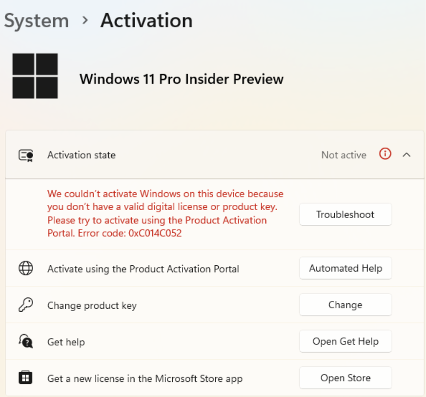
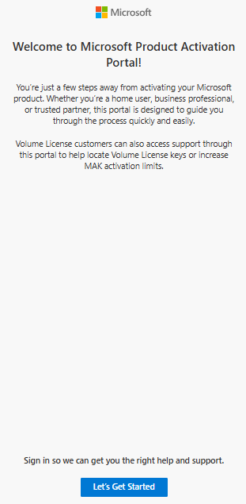
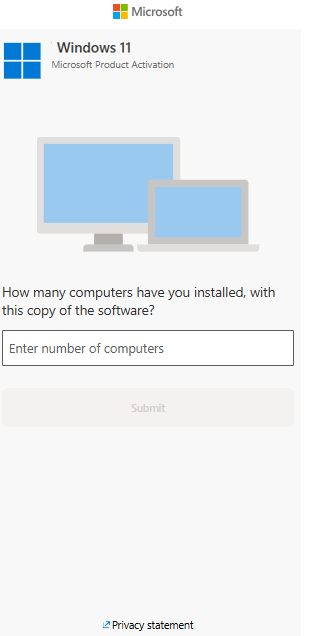
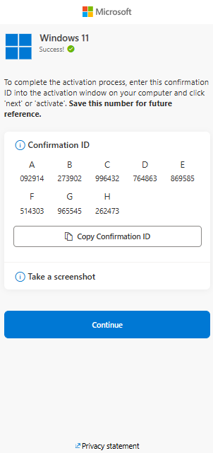

**Activation Experience Phase 1 – Demo UX Spec**

Source: Activation Experience Phase 1 deck \| Generated: 2026-02-16
07:34 (local)

# 1. Overview

This document specifies a clickable demo experience that mirrors the UX
shown in the provided PowerPoint deck. It is intended for rapid
prototyping (not a production build) so a developer can implement the
screens and navigation and then use an agent such as GitHub Copilot to
fill in boilerplate code.

# 2. Scope & Non‑Goals

In scope (demo):

- A multi-screen, clickable flow starting from Windows Activation
  Settings and continuing through the Product Activation Portal UX.

- Basic UI replication of the screens shown (layout, labels, buttons,
  and flow).

- Demo-friendly interactions (e.g., “Captcha” puzzle is not implemented;
  the Submit button advances the flow).

- Generation and display of a random Confirmation ID value on the
  “Receive Confirmation ID” screen.

- A branch to “Contact Assisted Support” when the user indicates
  activation did not succeed.

Out of scope (demo):

- Real activation, license validation, or backend integration.

- Real authentication flows (MSA/Entra ID/GOV); sign-in is simulated.

- Real Captcha puzzle behavior or bot detection.

- Localization, accessibility reviews, and production security
  hardening.

# 3. High-level user journey

Primary path (as implemented for demo):

1.  Settings Activation (Slide 1) → Automated Help → Product Activation
    Portal (Slide 2)

2.  Let’s Get Started → Security Verification (Captcha) → Sign‑In →
    Activation Flow (Slide 3)

3.  Answer \# of Computers → Receive Confirmation ID → Confirm
    Activation Result → Contact Assisted Support (if activation failed)

# 4. Global requirements

Navigation

- Use client-side routing or a simple state machine. Each button
  advances to the next screen exactly as described.

- Provide a “Back” affordance only if it exists in the screenshot UI;
  otherwise omit for fidelity.

Visual fidelity

- Maintain the UX intent, labels, and sequencing shown in the deck
  screenshots.

- For demo: typography and spacing can be approximate, but major UI
  elements (titles, buttons, step order) must match.

Demo data

- Confirmation ID is a randomly generated value (format is flexible for
  demo).

- “# of computers” threshold: \<= 1 is “within threshold”; \> 1 is
  “outside of threshold”.

# 5. Screen-by-screen specification

## S1. Windows Settings → Activation (Modern OA - Setting Experience)

Source slide: Slide 1

Screenshot (from deck):

Purpose

Entry point from Windows activation settings when activation fails;
provides an “Automated Help” entry to the portal flow.

UI elements

- Activation settings surface with an activation status area (as shown).

- Primary call-to-action: “Automated help” button.

Interactions

4.  User selects “Automated help” → navigate to S2.1 “Let’s Get
    Started”.

Validation / logic

- No inputs required on this screen for demo.

Implementation notes (demo)

- This screen can be implemented as a static mock of the settings page
  with only the “Automated help” button interactive.

## S2.1. Product Activation Portal – Let’s Get Started

Source slide: Slide 2

Screenshot (from deck):

On-screen copy (OCR from screenshot; verify against image)

BE Microsoft  
  
Welcome to Microsoft Product Activation  
Portal!  
  
You're just a few steps away from activating your Microsoft  
product. Whether you're a home user, business professional,  
or trusted partner, this portal is designed to guide you  
through the process quickly and easily.  
  
Volume License customers can also access support through  
  
this portal to help locate Volume License keys or increase  
MAK activation limits.  
  
Sign in so we can get you the right help and support.  
  
Let's Get Started

Purpose

Introduces the portal experience and starts the automated flow.

UI elements

- Header/branding: “Microsoft Support \| User Experience \| Product
  Activation Portal”.

- Title: “Let’s Get Started”.

- Body text (use the text shown in the screenshot).

- Primary CTA button at bottom: “Let’s Get Started”.

Interactions

5.  User selects “Let’s Get Started” → navigate to S2.2 “Security
    Verification (Captcha)”.

Validation / logic

- No inputs required.

Implementation notes (demo)

- Copy shown below is from OCR; verify wording against screenshot for
  final polish.

## S2.2. Product Activation Portal – Security Verification (Captcha)

Source slide: Slide 2

Screenshot (from deck):

On-screen copy (OCR from screenshot; verify against image)

BE Microsoft  
  
Security Verification  
  
Please solve a puzzle so we know you're not a bot.  
  
Switch to audio puzzle

Purpose

Simulates a security verification step. For demo purposes, no real
puzzle is required.

UI elements

- Title: “Security Verification”.

- Start button to begin verification.

- Puzzle/verification area with a Submit button (as shown).

Interactions

6.  User selects “Start” → reveal the verification/puzzle area if it is
    not already visible.

7.  User selects “Submit” → navigate to S2.3 “Sign‑In”.

Validation / logic

- No puzzle validation; “Submit” always advances.

Implementation notes (demo)

- Copy shown below is from OCR; verify wording against screenshot for
  final polish.

## S2.3. Product Activation Portal – Sign‑In

Source slide: Slide 2

Screenshot (from deck):

On-screen copy (OCR from screenshot; verify against image)

BE Microsoft  
  
Welcome to Microsoft Product Activation  
Portal!  
  
o..  
  
Sign in with your account  
  
Sign in using your email or mobile number associated  
with you or your business.  
  
Government Tenants:  
  
If you have an Azure Government tenant, choose from  
the dropdown first.  
  
Select your Government Tenant  
  
By logging in with your account, it will not associate the  
account fo the licenses.  
  
Proceed to Sign In  
  
Can't sign-in?

Purpose

Simulates user sign‑in options before continuing to the activation flow.

UI elements

- Title: “Sign‑In”.

- Supported account types: “MSA, Entra ID, & GOV Accounts”.

- Primary CTA: “Proceed to sign in” (active).

Interactions

8.  User selects “Proceed to sign in” → navigate to S3.1 “Answer \# of
    Computers Question”.

Validation / logic

- No actual auth; this is a simulated continuation.

Implementation notes (demo)

- Keep the “Proceed to sign in” button enabled to match the requested
  demo behavior.

- Copy shown below is from OCR; verify wording against screenshot for
  final polish.

## S3.1. Answer \# of Computers Question

Source slide: Slide 3

Screenshot (from deck):

On-screen copy (OCR from screenshot; verify against image)

BE Microsoft  
  
Hl Windows 11  
Ell Microsoft Product Activation  
  
How many computers have you installed, with  
this copy of the software?  
  
Enter number of computers  
  
Submit

Purpose

Collects the number of computers/devices involved and determines whether
the flow is within threshold.

UI elements

- Prompt asking for number of computers.

- Numeric input field.

- Submit button (active when input is present).

Interactions

9.  User enters a number in the input field.

10. User selects “Submit”.

11. If value \<= 1 → navigate to S3.2 “Receive Confirmation ID (within
    threshold)”.

12. If value \> 1 → treat as outside threshold (see Validation/logic).

Validation / logic

- Threshold rule from deck: \<= 1 is within threshold; \> 1 is outside
  threshold.

- For demo, outside threshold can either: (a) show an inline message and
  keep user on screen, or (b) route directly to assisted support. Choose
  one and keep it consistent.

Implementation notes (demo)

- Input should accept integers; basic guardrails (empty, non-numeric)
  are sufficient for demo.

- Copy shown below is from OCR; verify wording against screenshot for
  final polish.

## S3.2. Receive Confirmation ID (within threshold)

Source slide: Slide 3

Screenshot (from deck):

On-screen copy (OCR from screenshot; verify against image)

BE Microsoft  
  
Windows 11  
  
ll Success! @  
  
To complete the activation process, enter this confirmation  
ID into the activation window on your computer and click  
‘next’ or ‘activate’. Save this number for future  
reference.  
  
@ Confirmation ID  
  
A B Cc D E  
092914 §=6273902 9996432 764863 869585  
  
F G H  
514303 965545 «= 262473  
  
\[Copy Confirmation ID  
  
@ Take a screenshot  
  
2 Privacy statement

Purpose

Displays a generated Confirmation ID and lets the user continue.

UI elements

- A “Confirmation ID” value shown prominently (as shown).

- Continue button.

Interactions

13. On screen load, generate and display a random Confirmation ID.

14. User selects “Continue” → navigate to S3.3 “Confirm if Activation
    Succeeded or Failed”.

Validation / logic

- Confirmation ID must be stable for the session once generated (do not
  change when user returns to the screen in the same session, unless you
  explicitly reset the flow).

Implementation notes (demo)

- Format is flexible for demo (e.g., random digits grouped with
  spaces/hyphens).

- Copy shown below is from OCR; verify wording against screenshot for
  final polish.

## S3.3. Confirm if Activation Succeeded or Failed

Source slide: Slide 3

Screenshot (from deck):

On-screen copy (OCR from screenshot; verify against image)

BE Microsoft  
  
\| \| \| Windows 11  
  
\| {\| Microsoft Product Activation  
  
Were you successful activating your product?  
  
ry  
  
=  
  
2 Privacy statement

Purpose

Captures whether the user was able to activate after using the
Confirmation ID.

UI elements

- Question: whether activation succeeded.

- Yes and No options (radio buttons or buttons, matching screenshot).

- Continue/Next action if present in the screenshot.

Interactions

15. User selects “No” (could not activate) → navigate to S3.4 “Contact
    Assisted Support”.

16. User selects “Yes” (activated) → end of demo flow (optionally show a
    simple success message screen, if and only if it appears in your UI
    plan).

Validation / logic

- Selecting “No” must route to assisted support screen.

Implementation notes (demo)

- The user explicitly requested the “No” path for the demo; ensure it is
  implemented and easy to trigger.

- Copy shown below is from OCR; verify wording against screenshot for
  final polish.

## S3.4. Contact Assisted Support (Phone or Chat)

Source slide: Slide 3

Screenshot (from deck):

On-screen copy (OCR from screenshot; verify against image)

BE Microsoft  
  
Contact Assisted Support  
  
I can transfer you to a product activation support  
advocate, but you'll have to start the activation  
  
process again.  
  
fF Resume chat with a support agent.  
  
Exit  
  
2 Privacy statement

Purpose

Provides escalation options to reach live support when activation
failed.

UI elements

- Heading indicating contacting assisted support.

- Choice of support channel: Phone or Chat (as shown).

Interactions

17. User selects Phone → show a demo stub (e.g., “Phone support
    selected”).

18. User selects Chat → show a demo stub (e.g., “Chat support
    selected”).

Validation / logic

- This screen is reachable only when activation is failed (S3.3 = No) or
  when user is outside threshold (optional behavior in S3.1).

Implementation notes (demo)

- No real contact integration is required for demo.

- Copy shown below is from OCR; verify wording against screenshot for
  final polish.

# 6. Suggested implementation scaffold (optional)

The following section is optional guidance to help a developer implement
the demo quickly. It is not part of the UX requirements shown in the
deck.

Recommended approach

- Implement the flow as a finite state machine with one state per screen
  (S1, S2.1, S2.2, …).

- Store the entered “# of computers” and generated Confirmation ID in a
  single in-memory app state.

- Use a component per screen with shared layout/branding.

State model (example)

type AppState = {  
current: 'S1'\|'S2_1'\|'S2_2'\|'S2_3'\|'S3_1'\|'S3_2'\|'S3_3'\|'S3_4';  
computersCount?: number;  
confirmationId?: string;  
captchaStarted?: boolean;  
activationResult?: 'yes'\|'no';  
};
